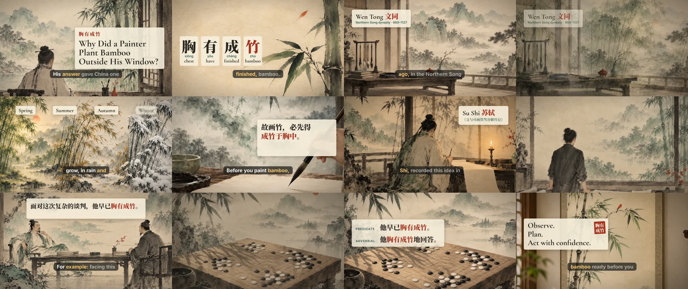

# video-gen-skill

An agent skill that makes **finished MP4 videos** from a one-line prompt, directly in your coding agent session (Claude Code, Codex, Cursor and others supported by [`skills`](https://github.com/vercel-labs/skills)).

```bash
npx skills add vincentfranstyo/video-gen-skill
```

Then ask your agent:

> make a narration video explaining the Chinese idiom 胸有成竹

## Example

`examples/chengzhu/`: a 76 s narration video, made from one prompt.



▶ [chengzhu-720p.mp4](examples/chengzhu/chengzhu-720p.mp4)

The example folder holds everything the agent wrote: `story.md`, `voiceover.json`, the `stage/` HTML/CSS/JS, and `post.json` (title, caption, hashtags, chapters).

## What it makes

| kind | for |
|---|---|
| `promo` | app / product / launch ads |
| `tutorial` | step-by-step walkthrough of a real web app |
| `narration` | voiced stories, history, explainers, lessons, news |
| `motion` | kinetic type, logo stings, data viz, intros (voice optional) |

Formats: vertical 1080×1920 (TikTok / Reels / Shorts) or 2560×1440 (YouTube). English narration with word-by-word captions.

## How it works

1. The agent writes the script, then `voice.ts` reads it aloud (Microsoft Edge read-aloud voices, free, no key) and records the timing of every word.
2. It generates one illustration per scene with an image API.
3. It builds the video as an HTML page where every frame depends only on time `t`: Ken Burns motion, kinetic text, captions.
4. `render.ts` opens that page in headless Chromium, takes a screenshot of each frame at 30 fps, checks the layout (cropped text, dead air, empty cuts), then muxes the frames with the voice using ffmpeg.

## Requirements

- [bun](https://bun.sh), `ffmpeg`, `jq`, `curl`
- Chromium for Playwright. The agent installs it on first run with `bun install && bunx playwright install chromium` inside the skill's `kit/` folder.
- **Image generation** (narration and promo art): set `IMAGE_GEN_API_KEY`. The script works with any OpenAI-compatible `/images/generations` endpoint:

  ```bash
  export IMAGE_GEN_API_KEY=sk-...
  export IMAGE_GEN_BASE_URL=https://api.openai.com/v1   # default
  export IMAGE_GEN_MODEL=gpt-image-1                    # default
  ```

  Image calls bill to your own API account.
- Optional: `yt-dlp` plus Python `numpy`/`scipy` for background music with beat sync.

## Configuration

| env | default | |
|---|---|---|
| `PROMO_JOBS_ROOT` | `~/promo-videos` | where job folders are created |
| `PROMO_VOICE` | `en-US-AndrewNeural` | any Edge neural voice |
| `PROMO_BROWSER_CHANNEL` | Playwright Chromium | `chrome` uses your installed Chrome |

## Notes

- Voice uses Microsoft Edge's undocumented read-aloud endpoint. It is free, but it can break if Microsoft changes it.
- The skill refuses to generate fake UI, real logos, real people's likenesses, or fake documents.
- Music fetched with `yt-dlp` is not licensed. The agent will say so.

## License

MIT
